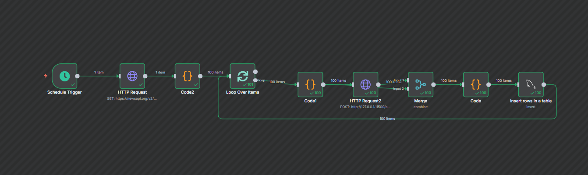

# 📰 NewsByteHub

NewsByteHub is a modern **AI-powered news summarization and aggregation
platform** inspired by apps like *Inshorts*.\
It fetches news from public APIs, processes and summarizes articles
using **n8n workflows with AI models**, and displays them in a **fast
and responsive React frontend**.

------------------------------------------------------------------------

## 🚀 Features

-   **Automated Summarization** -- News is shortened into easy-to-read
    snippets using AI (Ollama/OpenAI via n8n).\
-   **Backend API** -- Node.js + Express backend that serves summarized
    news to the frontend.\
-   **Database Integration** -- Supports MySQL/PostgreSQL/MongoDB for
    storing fetched news and summaries.\
-   **Frontend UI** -- Built with React + Vite, optimized for mobile and
    desktop.\
-   **Extensible Workflows** -- New APIs, categories, and custom
    automations can be added via n8n without changing backend code.\
-   **Conflict Handling** -- Automatically skips duplicate entries in
    the database.

------------------------------------------------------------------------

## 📂 Project Structure

    ├── .gitattributes
    ├── .gitignore
    ├── README.md
    ├── backend
    │   ├── config          # Database configuration
    │   │   └── database.js
    │   ├── routes          # API routes (e.g., /news)
    │   │   └── news.js
    │   ├── server.js       # Express server
    │   ├── package.json
    │   └── package-lock.json
    ├── eslint.config.js
    ├── index.html          # Vite entry point
    ├── package.json
    ├── package-lock.json
    ├── public              # Static assets
    │   └── vite.svg
    ├── src                 # React frontend
    │   ├── App.jsx
    │   ├── App.css
    │   ├── main.jsx
    │   ├── index.css
    │   └── assets/
    │       └── react.svg
    └── vite.config.js

------------------------------------------------------------------------

## 🛠️ Tech Stack

-   **Frontend:** React, Vite, TailwindCSS (for UI styling)\
-   **Backend:** Node.js, Express.js\
-   **Automation & Summarization:** [n8n](https://n8n.io/) (local or
    cloud)\
-   **Database:** MySQL / PostgreSQL / MongoDB\
-   **AI Models:** Ollama, OpenAI, or any LLM supported by n8n\
-   **Hosting (Optional):** Railway / Render / Vercel / Netlify

------------------------------------------------------------------------


## ⚙️ Setup & Installation

### 1. Clone the repository

``` bash
git clone https://github.com/your-username/newsbytehub.git
cd newsbytehub
```

### 2. Setup Backend

``` bash
cd backend
npm install
npm run dev   # or node server.js
```

### 3. Setup Frontend

``` bash
cd ..
npm install
npm run dev
```

The frontend will run on <http://localhost:5173>.

### 4. Setup n8n Workflow

1.  Install n8n globally:

    ``` bash
    npm install -g n8n
    n8n
    ```

2.  Open `http://localhost:5678`\

3.  Create a workflow:

    -   **HTTP Request Node** → Fetch news from public API (e.g.,
        NewsAPI, GNews)\
    -   **AI Summarization Node** → Send article content to AI model
        (Ollama/OpenAI)\
    -   **Database Node** → Insert summarized results into DB\
    -   **Webhook Node** → Forward to backend `/news` route

------------------------------------------------------------------------

## ⚙️ How It Works

1.  **n8n Workflow Runs** → Fetches raw news from APIs\
2.  **AI Summarization** → Uses LLMs to create 60-word summaries\
3.  **Database Save** → Summaries + metadata (title, URL, category,
    timestamp, image) stored in DB\
4.  **Backend API** → Express.js serves data via `/news` endpoint\
5.  **Frontend React App** → Displays summaries in a clean card-based UI
    (like Inshorts)

------------------------------------------------------------------------

## 📡 API Endpoints

  Method   Endpoint   Description
  -------- ---------- -------------------------------------
  GET      `/news`    Fetch summarized news
  POST     `/news`    Add new news entry (via n8n or API)

Example Response:

``` json
[
  {
    "title": "AI doesn’t belong in journaling",
    "url": "https://example.com/article",
    "summary": "Experts argue that AI-generated journaling lacks authenticity...",
    "category": "Tech",
    "published_at": "2025-08-25T14:07:07Z",
    "image": "https://example.com/image.jpg"
  }
]
```

------------------------------------------------------------------------

## 📌 Future Enhancements

-   🔐 User authentication & personalized feeds\
-   🏷️ Category filters (Sports, Tech, Politics, Entertainment)\
-   🔔 Push notifications for trending stories\
-   📱 React Native app for Android/iOS\
-   🌐 Multi-language news summarization

------------------------------------------------------------------------

## 🤝 Contributing

Pull requests and feature suggestions are welcome.\
Fork the repo, improve workflows, and submit a PR!

------------------------------------------------------------------------

## 📄 License

MIT License © 2025 NewsByteHub
